«Применение принципов IaaC в работе с виртуальными машинами» - «Бычков Денис Вячеславович»      
   

Задача 1

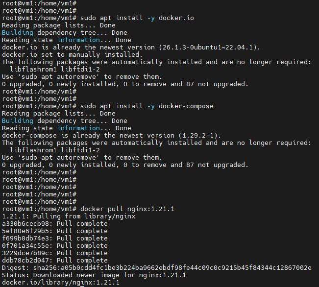

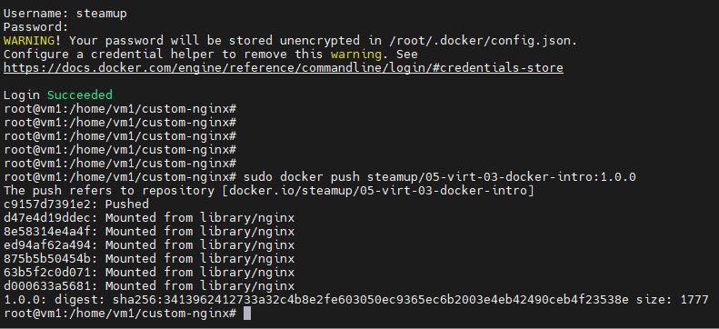

https://hub.docker.com/repository/docker/steamup/05-virt-03-docker-intro/tags/1.0.0/sha256-3413962412733a32c4b8e2fe603050ec9365ec6b2003e4eb42490ceb4f23538e

Задача 2

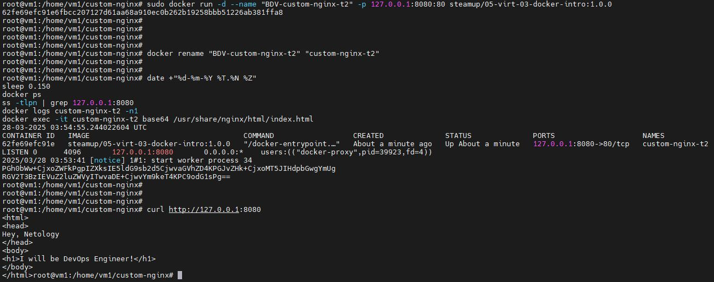

Задача 3

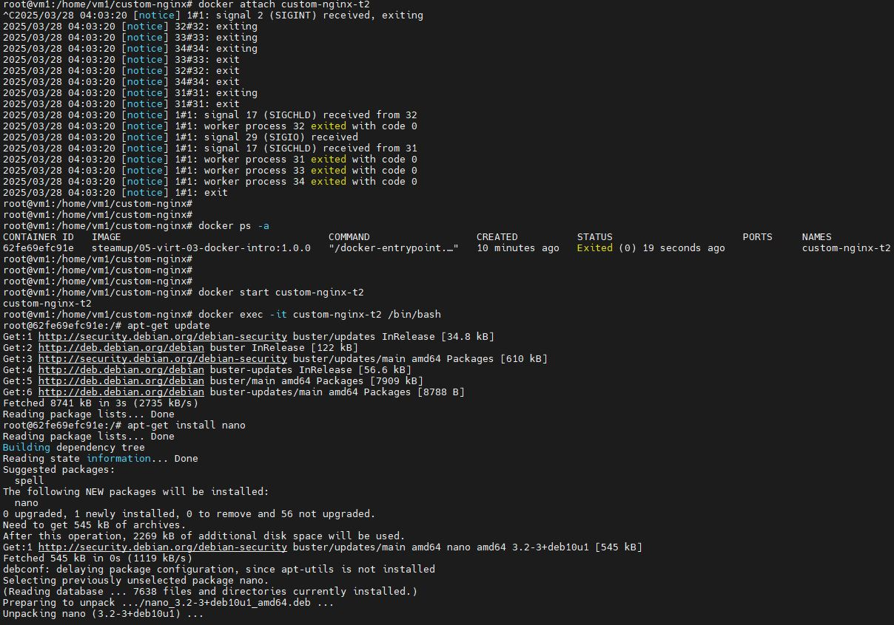

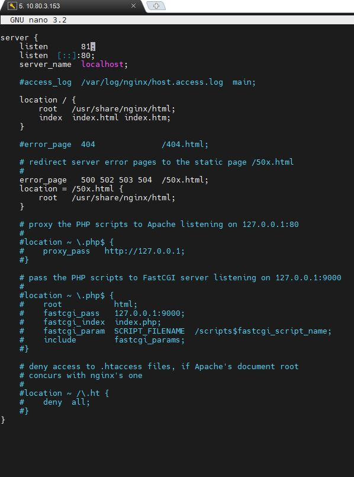

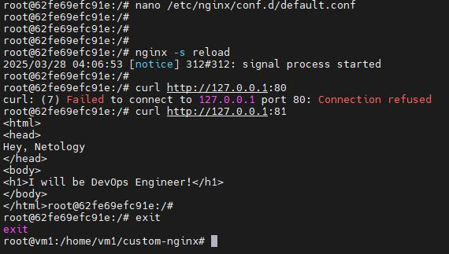

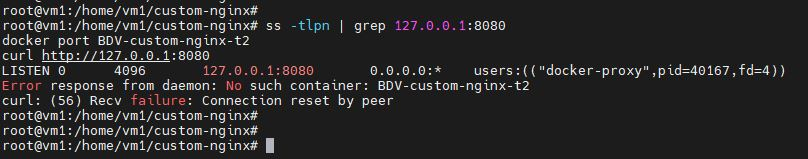

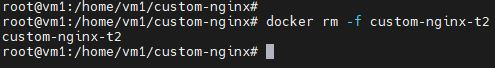

Задача 4

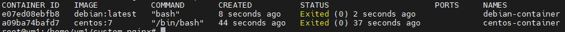

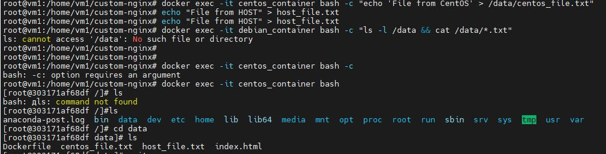

Задача 5

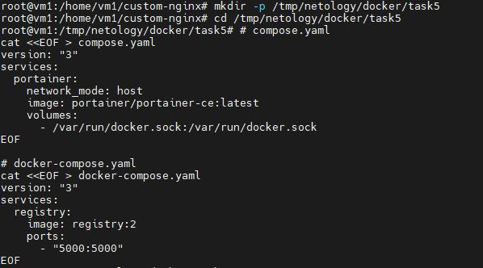

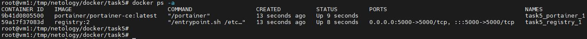

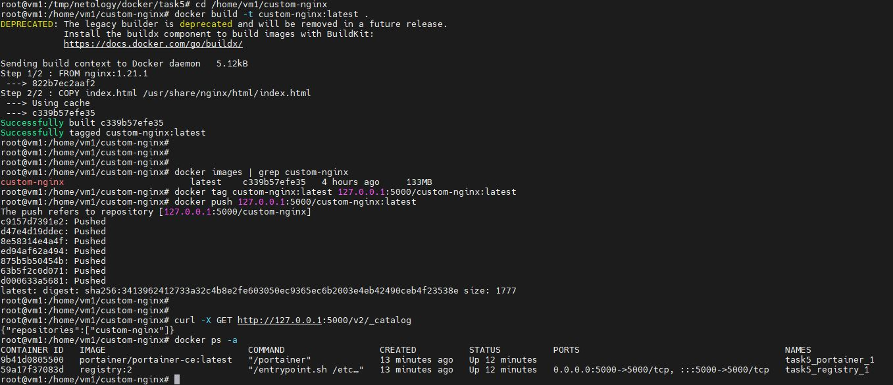

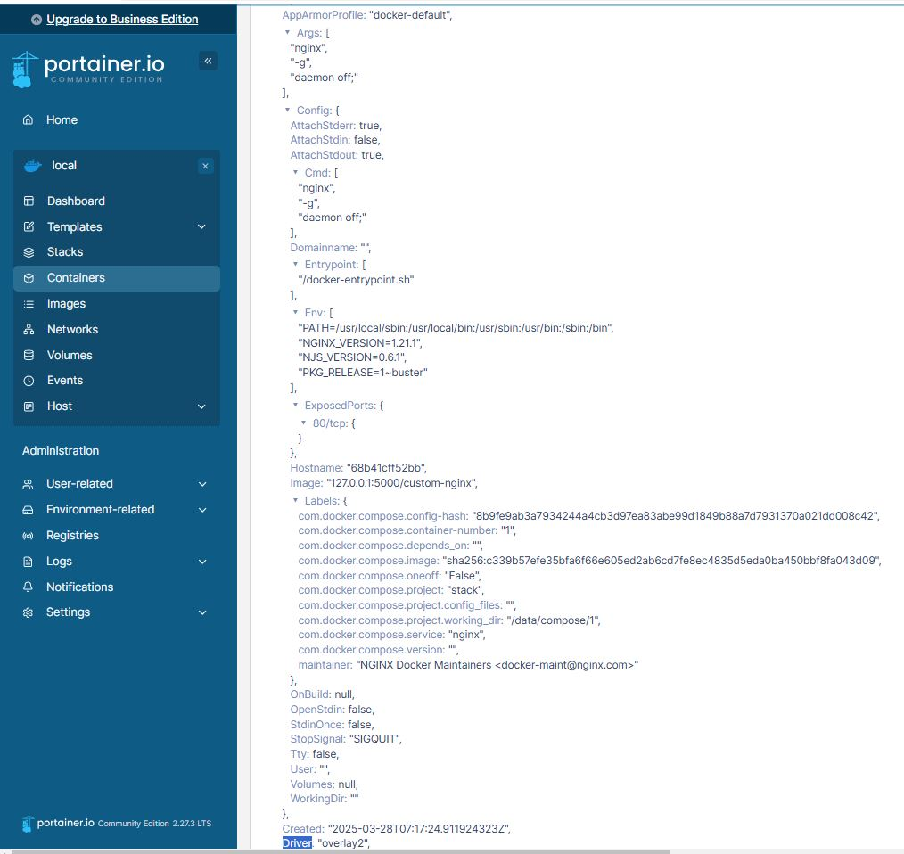

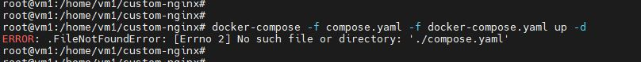

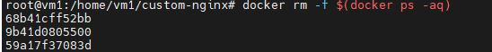